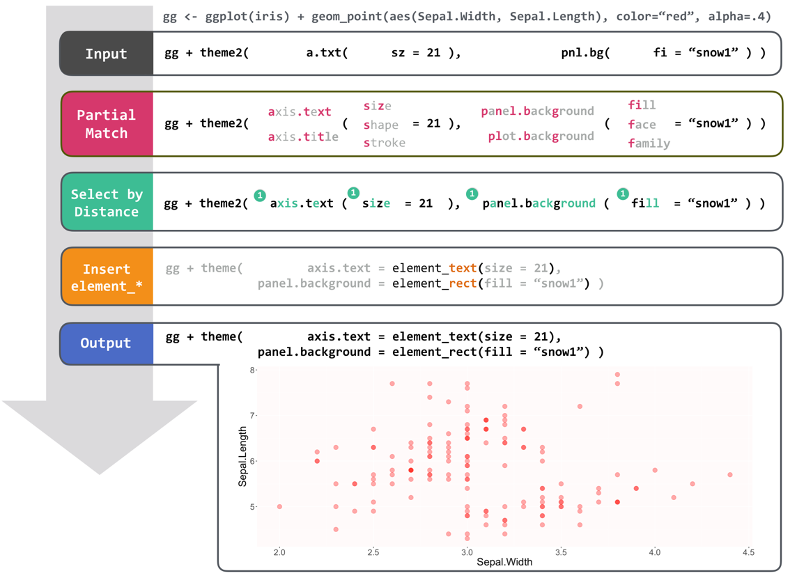

---
output:
  md_document:
    variant: markdown_github
---

<!-- README.md is generated from README.Rmd. Please edit that file -->

```{r, echo = FALSE}
knitr::opts_chunk$set(
  collapse = TRUE,
  comment = "#>",
  fig.path = "README-"
)
```

# ggconf

[](https://travis-ci.org/caprice-j/ggconf)
[](https://ci.appveyor.com/project/caprice-j/ggbash)
[](https://codecov.io/gh/caprice-j/ggbash)

<!-- [](https://coveralls.io/github/caprice-j/ggbash) -->
[](https://codeclimate.com/github/caprice-j/ggbash/issues)
[](http://www.repostatus.org/#wip)

ggconf provides a simpler `ggplot2::theme()` syntax.

The goal of ggconf is to make ggplot2 more comfortable to use for every user,
from beginners to professionals.

```{r, echo=FALSE}
library(ggplot2)
```

## Usage

```{r, eval=FALSE}
g <- ggplot(iris) + geom_point(aes(Sepal.Width, Sepal.Length))

g + theme2(ax.txt(sz=20, f="bold"), ax.ln(col='gray60', sz=2), panel.bg(fill="white"))
```

```{r example, echo=FALSE}
g <- ggplot(iris) + geom_point(aes(Sepal.Width, Sepal.Length))
g + ggplot2::theme(axis.text = element_text(size=20),
                   axis.line = element_line(colour="gray60", size=2),
                   panel.background = element_rect(fill="white"))
# gg iris + point Sepal.W Sepal.L col=Spec siz=Petal.W + theme text: size=20 face="bold"
```

The following ggplot2 command will draw the same plot.

```{r, eval = FALSE}
g + ggplot2::theme(axis.text = element_text(size=20, face="bold"),
                   axis.line = element_line(colour="gray60", size=2),
                   panel.background = element_rect(fill="white"))
```

### How to use 

If you change your `theme` call into `theme2` call, ggconf would work in some of the cases.
All of the followings return the same plot.

```r
g + theme( axis.text = element_text(size=20, face="bold")) # Case 1: Default (52 characters)
g + theme2(axis.text = element_text(size=20, face="bold")) # Case 2: ggconf
g + theme2(ax.txt(sz=20, f="bold"))                        # Case 3: ggconf  (32 characters)
```

## Features



### Partial Match

Even if the unique identification of specified elements
(theme element names and theme configuration arguments)
is not possible,
`ggconf` anyway tries to execute its best guess
instead of bluntly returning an error.

For the above `theme2()` input `theme2(ax.txt(sz=20, fc="bold"), ax.ln(col='gray60', sz=2), panel.bg(fill="white"))`,
ggconf performs partial matches seven times.

* __theme element names__
    + `ax.txt` matches `axis.text`. You can even write `a.t`.
    + `ax.ln` matches `axis.line`. You can even write `a.l`.
    + `panel.bg` matches `panel.background`. You can even write `pnl.bg`.
        + `p.bg` matches `plot.background` according to edit distance.


* __theme configuration arguments__
    + `sz` matches `size`.
    + `f` matches `face` (fontface).
    + `col` matches `colour`.

Users can select one of the styles which notation fits them best.    

### 2. Fixit (Error Diagnostics)

TBA

## Installation
```{r, eval=FALSE}
# install.packages("devtools")
devtools::install_github("caprice-j/ggconf")
```

+ If you get `no appender.console()` error,
you might need `install.packages('rly')`.
`packageVersion('rly')` should be at least 1.4.2.

+ This package is still in its infancy, and might contain several installation bugs.

## Goals

The goal of ggconf is to make it more intuitive to finalize your plots.

    + adjust colours or lineweights
    + rotate axis labels
    + decide tick label intervals and limits

<!--    + generate line-wrapped titles or legends -->

## Learning ggconf

`ggconf` follows original ggplot2 syntax
as much as possible for reducing learning costs of current ggplot2 users.

Learning ggplot2 might be the best way to understand ggbash syntax.
The [document](http://docs.ggplot2.org/current/) and
[book](https://github.com/hadley/ggplot2-book) of ggplot2 
would be helpful.

## Other Works

As far as I know, there are no previous attempts to implement
a higher-level language that
[transcompiles](https://en.wikipedia.org/wiki/Source-to-source_compiler) to parts of ggplot2.
Reports of similar attempts are welcomed.

<!--

About a different way to generate scatterplot matrix,
`GGally::ggpairs` does the similar work. The major differences are:

+ `GGally::ggpairs` output the scatterplot matrix in one plot,
  while `ggbash` outputs each subplot as a plot (or as a file).
+ `GGally::ggpairs` uses `ggplot2::ggsave` to save a plot with no default filename,
  while `ggbash` uses `| png ` or `| pdf` pipe chains with auto-generated filenames.

-->

`ggconf` draws inspiration from some other higher level programming
languages including Bash, CoffeeScript, Ruby, and Lisp.
Fixit is inspired by [Fix-It Hints](http://clang.llvm.org/docs/InternalsManual.html#fix-it-hints) in clang C++ compiler.

## Current Implementation Status

ggbash is first released on August 24, 2017.

+ DONE:
    + version 0.1 : lightweight port from ggbash
