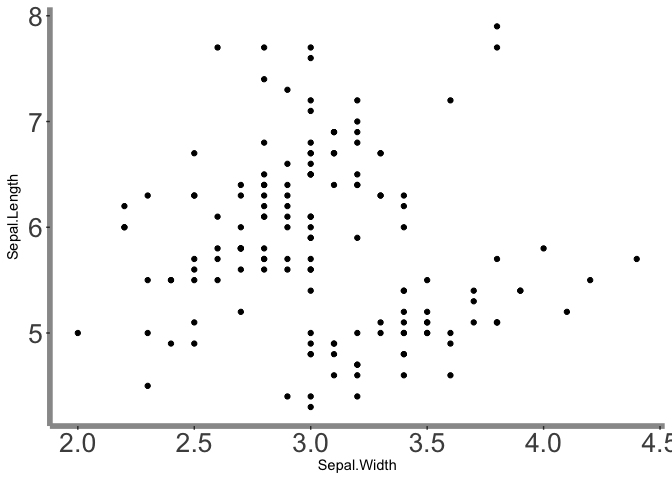
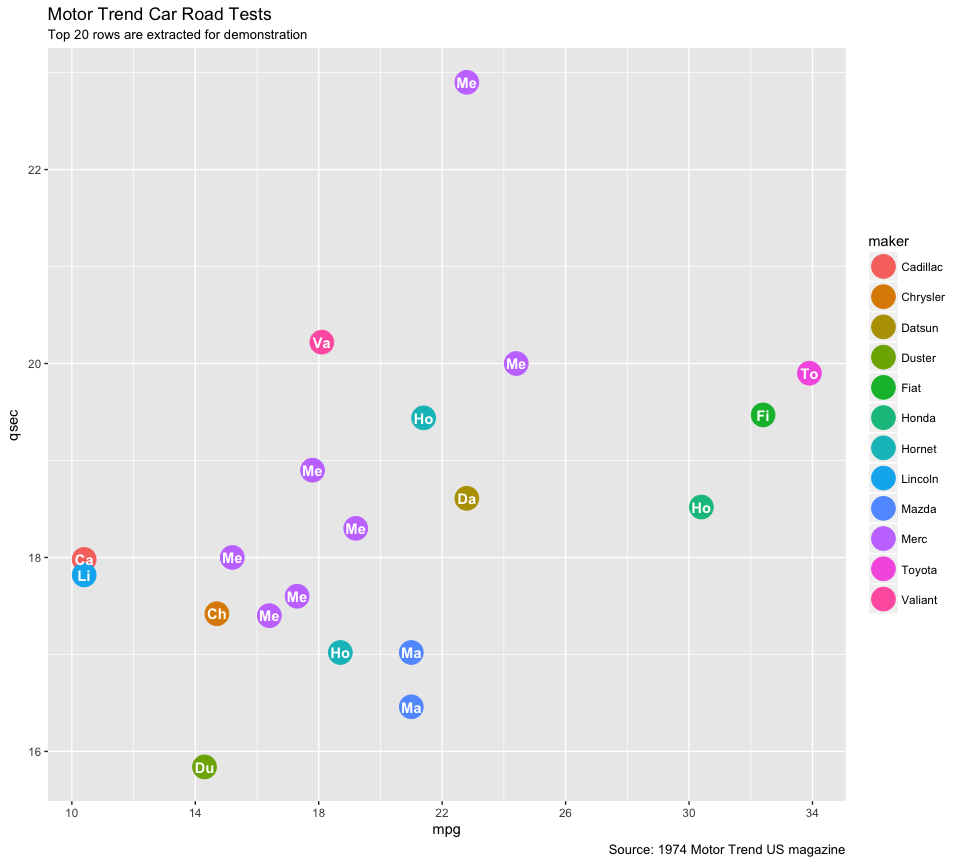
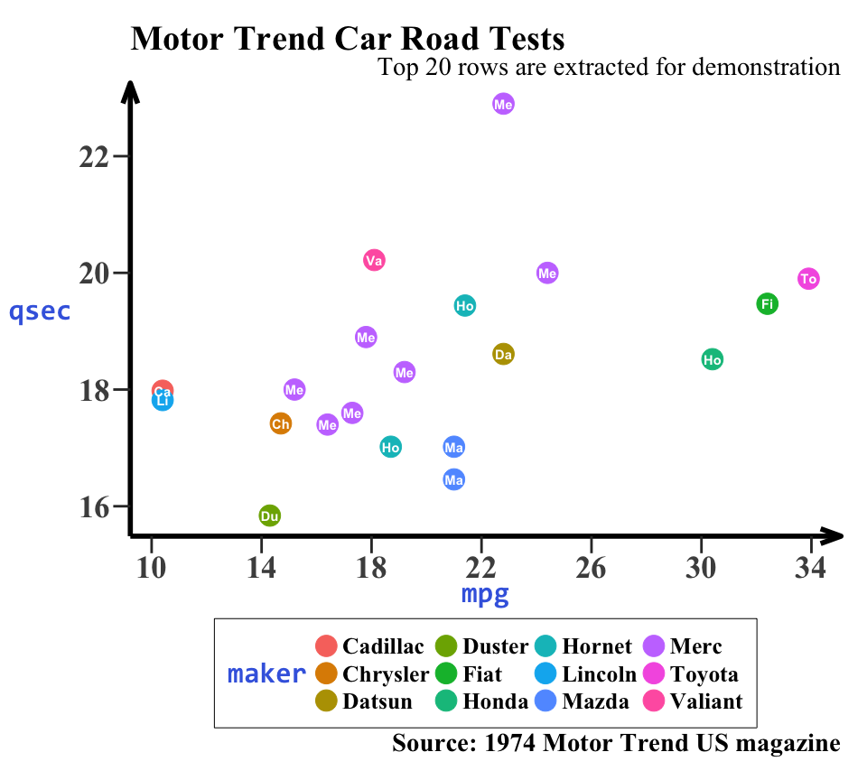

<!-- README.md is generated from README.Rmd. Please edit that file -->
ggconf
======

[](https://travis-ci.org/caprice-j/ggconf) [](https://ci.appveyor.com/project/caprice-j/ggconf) [](https://codecov.io/gh/caprice-j/ggconf)  <!-- [](https://coveralls.io/github/caprice-j/ggbash) --> [](https://codeclimate.com/github/caprice-j/ggconf/issues) [](http://www.repostatus.org/#wip)

ggconf provides `theme2()`, a flexible `ggplot2::theme()` interface.

Usage
-----

``` r
g <- ggplot(iris) + geom_point(aes(Sepal.Width, Sepal.Length))

g + theme2(ax.txt(sz=20, f="bold"),
           ax.line(col='gray60', sz=2),
           panel.bg(fill="white")
          )
```



The following ggplot2 command generates the same plot.

``` r
g + ggplot2::theme(axis.text = element_text(size=20, face="bold"),
                   axis.line = element_line(colour="gray60", size=2),
                   panel.background = element_rect(fill="white")
                  )
```

Getting Started
---------------

If you replace your `ggplot2::theme()` with `ggconf::theme2()`, ggconf would work. All of the followings return the same plot, and you can use the style you prefer the most.

``` r
g + theme( axis.text = element_text(size=20, face="bold")) # Style 1: ggplot2 default (50 characters)
g + theme2(axis.text = element_text(size=20, face="bold")) # Style 2: ggconf
g + theme2(axis.text(size=20, face="bold"))                # Style 3: ggconf without element_text()
g + theme2(ax.txt(sz=20, face="bold"))                     # Style 4: ggconf shorter but readable
g + theme2(at(z=20, f="bold"))                             # Style 5: ggconf shortest (25 characters)
```

Features
--------


### Partial Match

Even if the unique identification is not possible for specified elements (e.g. theme element names or arguments), `ggconf` tries to execute its best estimate instead of just returning an error.

For the input `theme2(ax.txt(sz=20, fc="bold"), ax.ln(c='gray60'), panel.bg(fill="white"))`, ggconf performs partial matches six times.

-   **theme element names**
    -   `ax.txt` matches `axis.text`. You can even write `a.t` or `at`.
    -   `ax.ln` matches `axis.line`. You can even write `a.l` or `al`.
    -   `panel.bg` matches `panel.background`. You can even write `pnl.bg`.
        -   `p.bg` matches `plot.background` according to edit distance.
-   **theme configuration arguments**
    -   `sz` or `z` match `size`.
    -   `f` matches `face` (fontface).
        -   `fill` needs to write not just `f` but `fi`.
    -   `c` matches `colour`.

Installation
------------

``` r
# install.packages("devtools")
devtools::install_github("caprice-j/ggconf")
```

-   If you get `no appender.console()` error, please `install.packages('rly')`.

Example
-------

The goal of ggconf is to make it less stressful to finalize your plots.

#### Raw ggplot2 plot

The following plot uses the ggplot2 default appearance settings.

``` r
suppressPackageStartupMessages(library(dplyr))
gg <- ggplot(mtcars[1:20, ] %>% tibble::rownames_to_column() %>% 
             mutate(car_name = rowname, maker = gsub(" .*", "", car_name) ) ) + 
      #geom_label(aes(mpg, qsec, label = substr(car_name, 1, 13), color=maker),
      geom_point(aes(mpg, qsec, color=maker), size=8) +
      geom_text(aes(mpg, qsec, label=substr(maker, 1, 2)), color="white", fontface="bold") +
      labs(title = "Motor Trend Car Road Tests",
           subtitle = "Top 20 rows are extracted for demonstration", 
           caption = "Source: 1974 Motor Trend US magazine") + 
           scale_x_continuous(breaks=seq(10,34, 4))
gg
```



-   When we consider making a presentation, this plot has several issues:
    -   **Axis titles** and **numeric values** are too small to see through remote screen sharing (i.e. low-resolution)
    -   **Y-axis title** is rotated and does not jump out at you unless carefully looking at it
    -   **Title** and **subtitle** fonts are not aesthetically appealing
    -   Does not necessarily conform to company-specific styles (e.g. white background)

For resolving these issues, you would add the following `theme()` configurations:

``` r
# If using ggplot2::theme():
gg + theme(
                   text = element_text(face="bold", size=24, family="Times New Roman"),
       panel.background = element_rect(fill="white"),
      legend.box.margin = margin(0.2,0.2,0.2,0.2,"cm"),
  legend.box.background = element_rect(colour="black"),
             legend.key = element_rect(fill="white"),
        legend.position = "bottom",
            legend.text = element_text(size=rel(0.8)),
           legend.title = element_text(family="Consolas", colour="royalblue"),
             axis.title = element_text(family="Consolas", colour="royalblue"),
           axis.title.y = element_text(angle=0, vjust=0.5),
              axis.text = element_text(size=rel(1.1)),
              axis.line = element_line(arrow=arrow(type="open",angle=20), size=2),
             axis.ticks = element_line(size=1),
      axis.ticks.length = grid::unit(0.5,"cm"),
          plot.subtitle = element_text(face="plain", hjust=1),
            plot.margin = margin(0.3,0.3,0.3,0.1,"inch")
  )
```



ggconf enables modifying these parameters with concice notations.

#### With ggconf

``` r
gg + 
  theme2(
       txt(f="bold", sz=24, family="Times New Roman"),    # make all text thicker/larger 
       pnl.bg(fill="white"),
       lgd.box.bg(c="black"),
       lgd.box.margin(.2, .2, .2, .2, "cm"),
       lgd.key(fill="white"),
       lgd.pos("bottom"),
       lgd.txt(z=rel(.8)),
       lgd.title(family="Consolas", c="royalblue"),       # equally-spaced font
       axs.title(family="Consolas", c="royalblue"),       # colorize axis titles
       axs.title.y(angle=0, vjust=.5),                    # rotate and centerize y axis label
       axs.txt(z=rel(1.1)),
       axs.line(arrow=arrow(type="open", angle=20), z=2), # 
       axs.tick(sz=1),                                    # tick or ticks? It doesn't matter
       axs.tick.len(.5, "cm"),
       plt.subtitle(f="plain", hjust=1),
       plt.margin(.3, .3, .3, .1, "inch")                 # adjust margins
  )
```

Other Works
-----------

`ggconf` draws inspiration from some other higher level programming languages including Bash, CoffeeScript, Lisp, and Ruby.

<!-- Fixit is inspired by [Fix-It Hints](http://clang.llvm.org/docs/InternalsManual.html#fix-it-hints) in clang C++ compiler. -->
Current Implementation Status
-----------------------------

ggbash is first released on August 24, 2017.

-   DONE:
    -   version 0.1 : lightweight port from ggbash
